# MathSlides

> **Write like Notion. Math like Overleaf. Present as slides.**

MathSlides is a compact macOS presentation editor for technical and research talks. You type structure with `#` and `/` commands, write equations in familiar LaTeX, cite papers by pasting arXiv links, and edit everything directly on the slide.

<p align="center">
  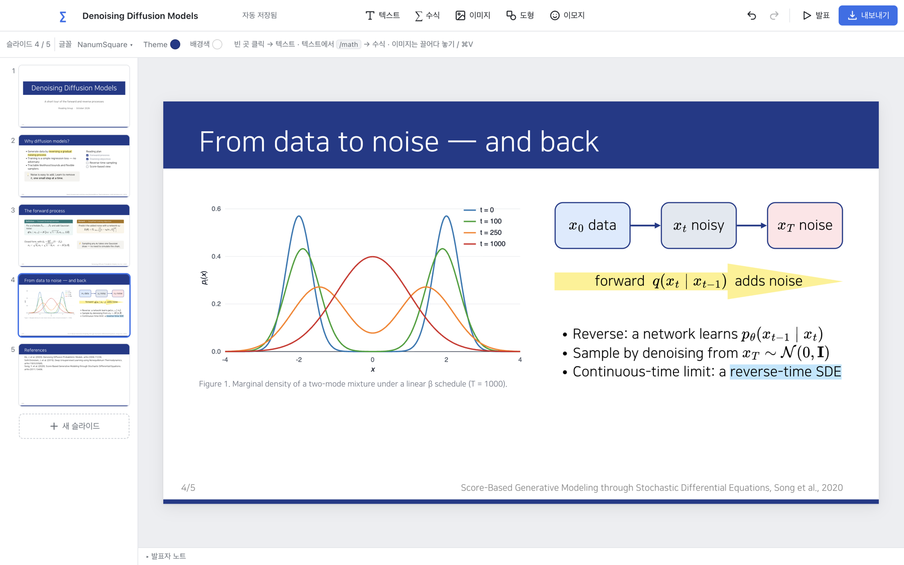
</p>

<p align="center">
  <a href="#write-like-notion">Write</a> ·
  <a href="#math-like-overleaf">Math &amp; citations</a> ·
  <a href="#present-as-slides">Slides</a> ·
  <a href="#made-with-mathslides">Showcase</a> ·
  <a href="#install-on-macos">Install</a> ·
  <a href="#updating-mathslides">Updating</a> ·
  <a href="#development">Development</a>
</p>

---

## Why MathSlides?

Writing in Notion is fast: `#` for a heading, `/` for a block, keep going. LaTeX math is natural once your fingers know it. But building a research talk usually means switching to a much larger slide tool, digging through menus, and picking font sizes one box at a time.

MathSlides keeps the parts of those workflows that matter for a talk, in one small app that runs locally with no account:

- **Write like Notion:** a fixed `#` / `##` text scale, a `/` command menu, todo lists, and one-click highlights.
- **Math like Overleaf:** LaTeX equations rendered as you type, plus arXiv citations that build the References slide for you.
- **Present as slides:** a 16:9 canvas you edit directly, an outline that generates section slides, a theme color, presentation mode, and PDF / PPTX export.

## Write like Notion

### Predictable text hierarchy

You don't pick font sizes from a menu. Type a Markdown prefix at the start of a line and the line snaps to a fixed size from one shared scale:

| You type | Size on the slide | Typical use |
|---|---|---|
| `# ` | **80** | Title |
| `## ` | **50** | Slide heading |
| `### ` | **30** | Subheading / template body |
| `#### ` | **25** | Body text |

Backspace at the start of the line reverts it. The same scale drives the built-in Title and Content templates, so every slide in a deck lines up. (Sizes are px on a 1280×720 slide, which equals pt in the exported 13.33″ widescreen deck.)

### Slash commands

Type `/` inside any text box to open the command menu, then keep typing to filter:

<table>
<tr>
<td width="50%" valign="top">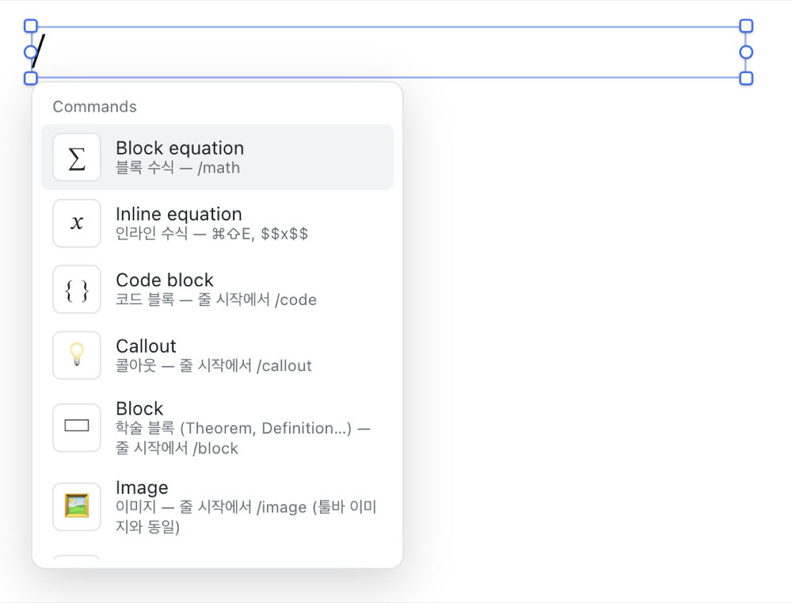</td>
<td width="50%" valign="top">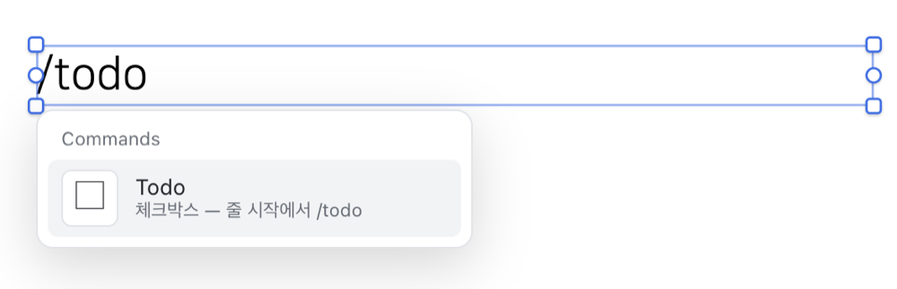<br><br>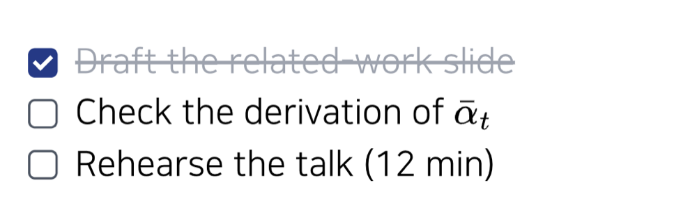</td>
</tr>
<tr>
<td align="center"><sub>Type <code>/</code> to see every command.</sub></td>
<td align="center"><sub><code>/todo</code> + Enter turns the line into a checklist.</sub></td>
</tr>
</table>

| Command | Inserts |
|---|---|
| `/math` | Block equation (LaTeX, rendered live) |
| `/inline` | Inline equation (also `⌘⇧E`, or type `$$x^2$$`) |
| `/todo` | Checklist item. Click the box to check it off; Enter adds the next item |
| `/callout` | Rounded note panel with an emoji icon (💡 by default, any emoji via the picker) |
| `/block` | Beamer-style block: Block, Theorem, Definition, Lemma, Proposition, Example, Remark |
| `/code` | Code block with Plain Text / Python / C / Bash highlighting |
| `/image` | Image from a file (drag-and-drop and `⌘V` paste also work) |
| `/bullet`, `/number` | Bulleted / numbered list (or just type `- ` / `1. `) |

`/code`, `/callout`, `/block`, `/image` and `/todo` are offered at the start of a line. Also: `| ` starts a quote, `**bold**` works as expected, `Tab` / `⇧Tab` indent list items, and the format bar adds colors, six highlight colors, and inline code to a selection.

## Math like Overleaf

### LaTeX, rendered as you type

Type `/math`, press Enter, and write LaTeX. Enter puts you back in your text.

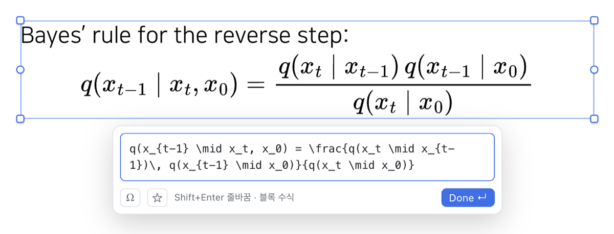

- **Inline or display.** `/math` for display equations; `$$…$$`, `/inline`, or `⌘⇧E` (on selected text) for math inside a sentence, including inside shapes, callouts, and theorem blocks.
- **Vector everywhere.** Equations are rendered by [MathJax 3](https://www.mathjax.org/) to SVG, and the same SVG is used in the editor, presentation mode, the PDF, and the PPTX.
- **Optional helpers.** The `Ω` button opens a palette of symbols and templates (Greek, operators, `\mathbb{}`, fractions, matrices, `cases`, …). The ☆ button saves the current expression as a favorite you can reinsert from the palette.
- **Click to edit** any equation later. While the LaTeX is invalid, the last good render stays visible and the error is shown in the popover.

> **Scope:** this is MathJax's TeX input for *math* (most AMS-style math commands work). It is not a full LaTeX document engine: there is no document preamble, no packages beyond what MathJax provides, no shared macro file, and no Overleaf project import.

### arXiv citations → References slide

Every slide has a reference field in its bottom-right footer. Paste an **arXiv URL** there (or type one and press Enter), and MathSlides turns it into a citation:

<p align="center">
  
</p>

<p align="center">
  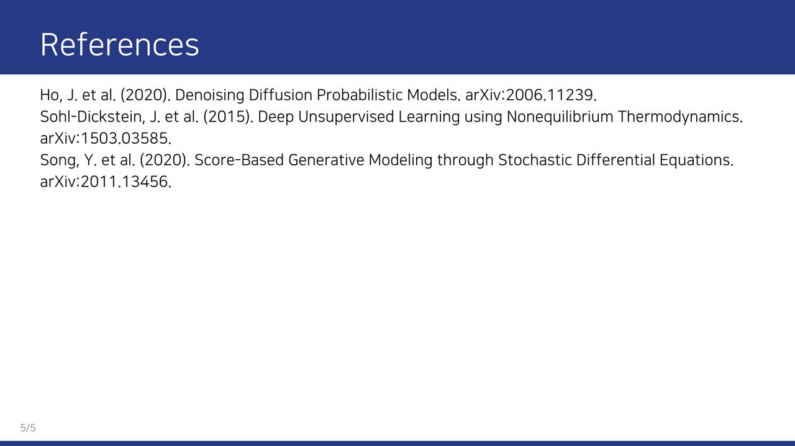
</p>

1. **Paste:** an `arxiv.org/abs/…`, `/pdf/…` or `/html/…` URL (a version such as `v7` is fine).
2. **Cite:** MathSlides fetches the title, authors, and year from arXiv and shows a short citation linked to the paper. The `×` on a citation removes it from that slide. Other text in the footer stays as a plain note.
3. **Collect:** a **References** slide is created at the end of the deck (before a Thank-you slide) and kept up to date. Each paper appears once even if cited on several slides, in compact author-year style, sorted by first author. A long list continues on *References (cont.)*, and the slide is removed when no citations remain (unless you added your own content to it).

This workflow is **arXiv-only** for now. Other links, DOI links, and bare arXiv IDs are not converted; they stay as plain footer text. Citations are author-year, not numbered, and fetching the metadata needs a network connection.

## Present as slides

### Direct canvas editing

Everything on a slide is an object you can drag and resize. Alignment guides snap to the edges and centers of the slide and of other objects (hold `⌥ Option` to turn snapping off).

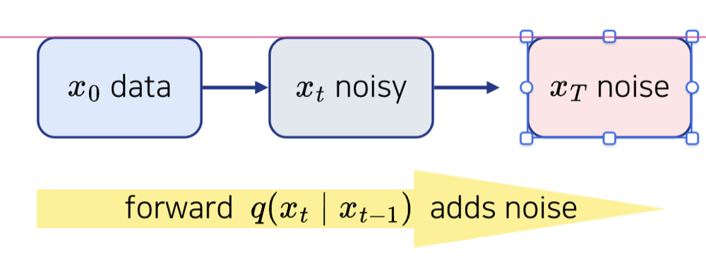

- **Text boxes:** click an empty spot (or press `T`). The height follows the content, and dragging a corner scales the font.
- **Shapes:** rectangle `R`, rounded rectangle, ellipse `O`, line `L`, arrow `A`, and a block arrow with adjustable shaft and head. Double-click a shape to type inside it.
- **Images:** drag in, paste, or `/image`. Corner drag keeps the aspect ratio, `⇧ Shift`+drag crops (non-destructively), and you can add a caption.
- **Arrange:** multi-select, align/distribute, `⌘D` duplicate, `⌘]` / `⌘[` to reorder, arrow keys to nudge, and full undo/redo.

### Outline → section slides

Right-click a slide in the slide list and choose **목차 슬라이드 추가** (*Add contents slide*). Each item you type in its numbered list becomes a section, and MathSlides generates a section slide for it (*Part n. Name*).

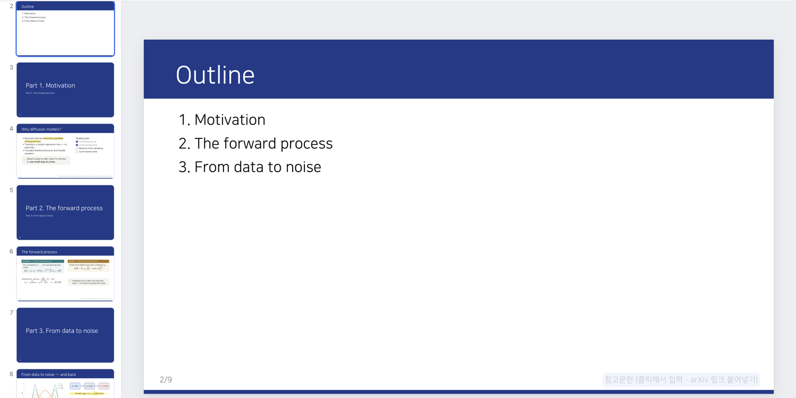

- **Kept in sync:** rename, add, remove, or reorder outline items and the section slides' titles, numbering, and "next part" lines follow. Removing an item removes its section slide.
- **Placement is manual:** a new section slide is added near the end of the deck (before References). Drag it to where that part begins; content slides are never moved for you.
- **Linked:** clicking an outline entry jumps to its section slide in the editor, presentation mode, the PDF, and the PPTX.

### Theme color

The **Theme** control in the top bar (with nothing selected) sets one presentation-wide color:


- It colors the title band, content-slide headers, section-slide backgrounds, and a thin footer accent, and keeps text on them readable.
- **Other Colors…** accepts any HEX value (or the picker/eyedropper), and **☆** saves it to **My Colors** for all your presentations. The same bar sets the presentation font (NanumSquare, Pretendard, Noto Serif KR).

## Made with MathSlides

A reading-group deck built in the current app. Everything below is regular MathSlides content: themed templates, typed Markdown shortcuts, slash-command blocks, LaTeX, a plotted figure inserted as an image, shapes, and arXiv citations. Its References slide is the one shown [above](#arxiv-citations--references-slide).

<p align="center">
  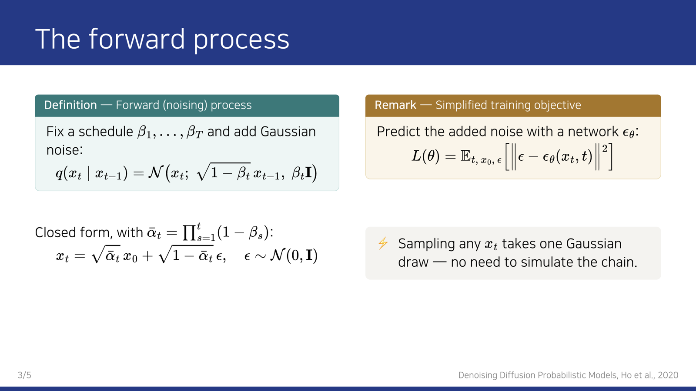
</p>

<table>
<tr>
<td width="50%">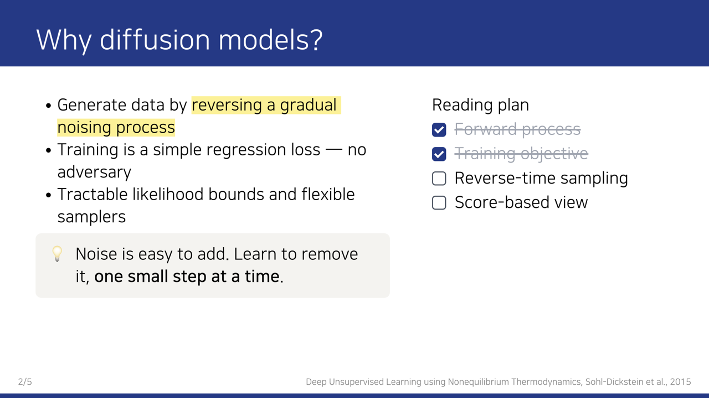</td>
<td width="50%">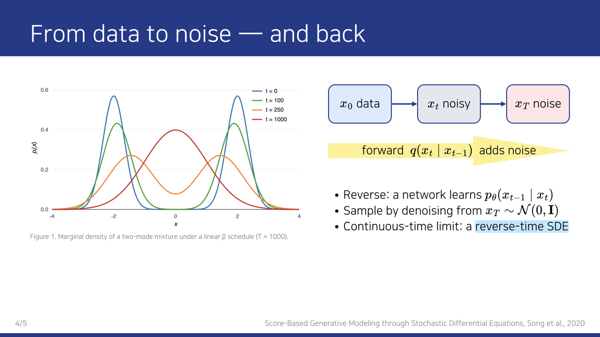</td>
</tr>
</table>

## Key features

- **Rich text:** bold, italic, underline, strike, text colors, six highlight colors, inline code, and lists.
- **Structured blocks:** callouts, Beamer-style theorem/definition blocks, todo lists, quotes, and syntax-highlighted code.
- **Figures and diagrams:** images with crop and captions, shapes with text, lines, arrows, adjustable block arrows, and standalone emoji (10 customizable quick emojis plus a full searchable picker).
- **Present and export:** full-screen presentation mode (`⌘↵` / `F5`), **PDF** with selectable text and vector equations (`⌘P`), and editable **PPTX** with native text boxes, shapes, and speaker notes (`⌘E`).
- **Personal shortcuts:** saved colors, favorite math expressions, and quick emojis are kept as your preferences across presentations.
- **Files:** autosave, `.mslides` documents (`⌘S` / `⌘O`) that open from Finder with a double-click, and recovery of displaced work.

> The app's menus and tooltips are currently in **Korean** (e.g. 내보내기 = Export, 발표 = Present). Slash commands, LaTeX, and keyboard shortcuts are the same in any language.

---

## Install on macOS

> **There is no prebuilt download yet.** The repository does not publish GitHub Releases or a downloadable `.dmg`. For now you build the app once on your Mac, which takes a few minutes.

**Requirements:** a Mac with **Apple Silicon** (the build targets `arm64`), [Node.js](https://nodejs.org/) (the LTS version is fine), and Git.

**1. Build the app**

```bash
git clone https://github.com/Kimtona/math-slides.git
cd math-slides
npm install
npm run dist:mac
```

This creates, in the git-ignored `release/` folder:

- `release/MathSlides-<version>-arm64.dmg`
- `release/mac-arm64/MathSlides.app`

**2. Install it**

Open the `.dmg` and drag **MathSlides** into **Applications**. Then launch it from Applications or the Dock.

**3. First launch**

The app is **not signed or notarized**, so macOS may say it can't verify the developer the first time you open it. If that happens with the build you just made, go to **System Settings → Privacy & Security**, find the message about MathSlides, and click **Open Anyway**. On older macOS versions, right-click **MathSlides.app → Open** also works. You only need to do this once per installed copy.

## Updating MathSlides

**MathSlides has no automatic updater.** The installed app never checks for or downloads new versions, and pulling the repository does **not** change the app in `/Applications`. These are two separate steps:

**A. Update the source**

```bash
cd math-slides
git pull
npm install        # picks up any dependency changes
```

This only updates your local copy of the code. If you run MathSlides from source (`npm run app`), the next launch uses the new code.

**B. Update the installed `/Applications/MathSlides.app`**

1. Rebuild after pulling: `npm run dist:mac`.
2. Quit MathSlides.
3. Open the new `release/MathSlides-<version>-arm64.dmg` and drag **MathSlides** into **Applications**, choosing **Replace**.
4. Relaunch. Because the new build is again unsigned, macOS may ask you to confirm the first launch again.

Your work is not stored inside the app bundle. `.mslides` files are ordinary files wherever you saved them, and the internal autosave/recovery data lives in the app's user-data folder. Replacing `MathSlides.app` leaves both in place.

## Development

```bash
npm install
npm run app:dev     # Electron + Vite dev server with hot reload
npm run app         # production build, then launch in Electron
npm run dev         # browser only, http://localhost:5173 (use Chrome)
```

| Command | What it does |
|---|---|
| `npm run typecheck` | TypeScript check (`tsc -b`) |
| `npm run build` | Typecheck + production Vite build into `dist/` |
| `npm test` | Headless model tests + Electron GUI tests (hidden windows, isolated temporary profile; `MATHSLIDES_TEST_VISIBLE=1` to watch) |
| `npm run dist:mac` | Package the macOS app and `.dmg` into `release/` |
| `npm run dist:win` | Windows NSIS installer (configured, not yet validated) |

You can also double-click `MathSlides.command` in Finder to run the app from source.

**Stack:** React 18 + TypeScript + Vite · TipTap (ProseMirror) for rich text · MathJax 3 (SVG) for equations · zustand + immer for state and undo · IndexedDB autosave · pptxgenjs for PPTX · Electron for the desktop shell and `printToPDF`.

Contributors: start with [`CLAUDE.md`](CLAUDE.md) and [`docs/PROJECT_STATUS.md`](docs/PROJECT_STATUS.md), which cover the architecture, persistence model, invariants, and validation status.

<details>
<summary><b>Keyboard and editing reference</b></summary>

| Action | How |
|---|---|
| Text box | Click an empty spot (nothing selected) or press `T` |
| Edit text | Click a selected box again, double-click, or `Enter` |
| Equation-only box | `M` or the toolbar's 수식 button |
| Image | Drag and drop, `⌘V`, `I`, or `/image` (PNG / JPEG / WebP / GIF / SVG) |
| Image resize / crop | Handle drag keeps ratio · `⌥`+drag free · `⇧`+drag crop · double-click to edit the crop |
| Snapping | Automatic. Hold `⌥` to disable, hold `⇧` on the idle canvas to preview guides |
| Undo / redo | `⌘Z` / `⌘⇧Z` |
| Copy / paste / duplicate | `⌘C` `⌘V` `⌘X` `⌘D`, arrows nudge (`⇧` = 10 px) |
| Z-order | `⌘]` `⌘[` (with `⇧` = to front/back) |
| Slides | In the slide list: `Enter` new, `⌘D` duplicate, `⌫` delete, drag to reorder, right-click for Title / contents (outline) / Thank-you slides |
| Save / open | `⌘S` / `⌘O` (`⌘⇧S` Save As) |

</details>

<details>
<summary><b>Export details and known limitations</b></summary>

- **PDF** (desktop app): every slide is rendered 1:1 and printed by Chromium to 960×540 pt pages with embedded fonts (selectable text) and vector equations.
- **PPTX:** text becomes editable PowerPoint text boxes (bold/italic/underline/color/bullets/highlight). Shapes, lines, callouts, blocks, todo checkboxes and code blocks become native shapes with editable text, and images keep native crop. Speaker notes are included.
- Equations in PPTX are SVG pictures (with a PNG fallback), not native PowerPoint equations.
- A PPTX line that contains inline equations is split into several positioned text boxes, so heavy editing in PowerPoint can disturb its layout.
- For PowerPoint to show the same font, install the font you used locally (e.g. NanumSquare). The editor and PDF already embed it.
- No rotation, grouping or tables. Crop is rectangular only.
- Fonts with Korean glyphs (including NanumSquare) display `\` as `₩` in normal text. Equations are unaffected.

</details>

## Project status

- **Platform:** macOS on Apple Silicon is the primary, tested platform (current version **1.0.0**). A Windows installer configuration exists but has **not** been validated on a real Windows machine.
- **Distribution:** you build locally (see [Install](#install-on-macos)). Signing, notarization, automatic updates, and published releases are not implemented yet.
- **Development stage:** in active use for real presentations. Fixes come from that day-to-day use. Planned work is tracked in [`docs/PROJECT_STATUS.md`](docs/PROJECT_STATUS.md) and [`docs/V2_PLAN.md`](docs/V2_PLAN.md).
